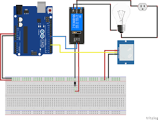

# Automated Lightning System

## Overview

The Automated Lightning System is an Arduino-based project designed to control lighting based on motion detection. It uses a PIR (Passive Infrared) sensor to detect motion and a relay module to turn the light on or off accordingly.

## Components Used

- **Arduino Board** (e.g., Arduino Uno, Nano)
- **PIR Sensor** (Detects motion)
- **Relay Module** (Controls the light)
- **Jumper Wires** (For connections)

## Circuit Diagram

## Files

- **`main.ino`**: Main Arduino sketch that utilizes the `PIRSensor` and `Relay` classes.
- **`src/PIRSensor.h`**: Header file for the `PIRSensor` class.
- **`src/PIRSensor.cpp`**: Implementation file for the `PIRSensor` class.
- **`src/Relay.h`**: Header file for the `Relay` class.
- **`src/Relay.cpp`**: Implementation file for the `Relay` class.

## Setup Instructions

1. **Install Arduino IDE:**
   Download and install the Arduino IDE from the [official website](https://www.arduino.cc/en/software).

2. **Install Required Libraries:**
   No additional libraries are required for this project.

3. **Upload the Code:**
   - Open the Arduino IDE.
   - Navigate to **File** > **Open** and select `main.ino` from the project folder.
   - Connect your Arduino board to your computer via USB.
   - Select the correct board and port from **Tools** > **Board** and **Tools** > **Port**.
   - Click the **Upload** button to upload the sketch to your Arduino board.

4. **Connect Components:**
   - **PIR Sensor:** Connect the VCC and GND pins to the Arduino’s 5V and GND, respectively. Connect the signal pin to Arduino pin 2.
   - **Relay Module:** Connect the VCC and GND pins to the Arduino’s 5V and GND, respectively. Connect the control pin to Arduino pin 3.

5. **Testing:**
   - Once uploaded, the system will start detecting motion. When motion is detected, the relay will turn on the connected light, and the Serial Monitor will display "Motion detected!".
   - When no motion is detected, the relay will turn off the light, and the Serial Monitor will display "No motion."

## Example Output

In the Serial Monitor, you will see:
- **"Motion detected!"** when the PIR sensor detects motion.
- **"No motion."** when the PIR sensor does not detect motion.

## Troubleshooting

- **No Output:** Ensure all connections are correct and the Arduino is properly connected to your computer.
- **Sensor Not Working:** Verify the PIR sensor is correctly connected and check if it’s receiving power.

## License

This project is licensed under the MIT License. See the [LICENSE](LICENSE) file for more details.

